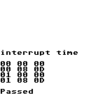

# GameBoyの割り込みタイミングテスト

割り込みハンドラを実行するタイミングを、通常速モードと倍速モードの両方でテストします。



画像は、BGB v1.5.7でテストを行った際のテスト結果の画面です。

1つ1つの行がテストケースに対応しています。

各行の最初の1つ目の数字(一番左)はCPUの速度を表しています。(0=通常速, 1=倍速)

2つ目の数字はIFにセットした値です。これが00だと割り込みは起きません。

3つ目の数字は割り込みまでに要したサイクル数です。

通常速モードでも倍速モードでも正しい挙動では割り込みハンドラの実行に13サイクルを必要とします。

```
行 | 速度 | IF | 要したサイクル
-----------------------
1  | 00  | 00  | 00          ; IF=0なので割り込みリクエストをしていないので0サイクルが正しい
2  | 00  | 08  | 0D          ; IF=0b1000で割り込みを起こしているので13サイクル
3  | 01  | 00  | 00          ; 倍速
4  | 01  | 08  | 0D          ; 倍速
```
